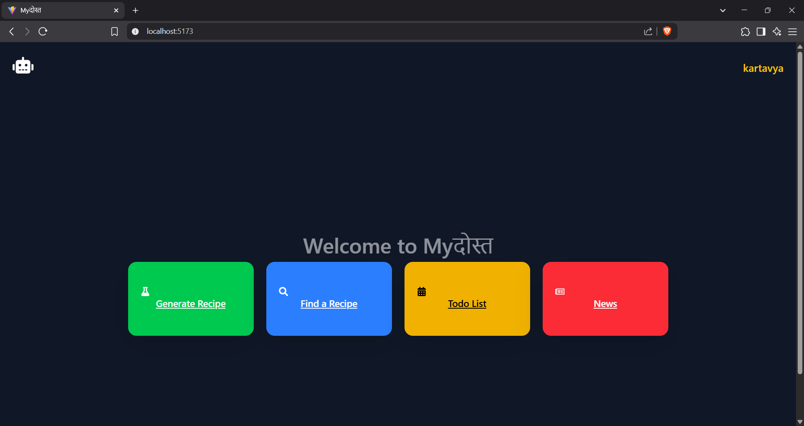
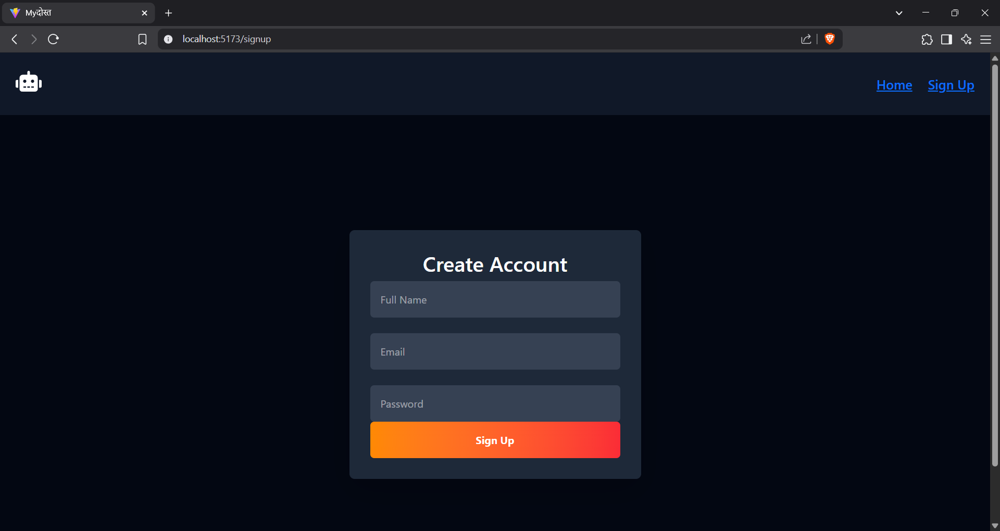
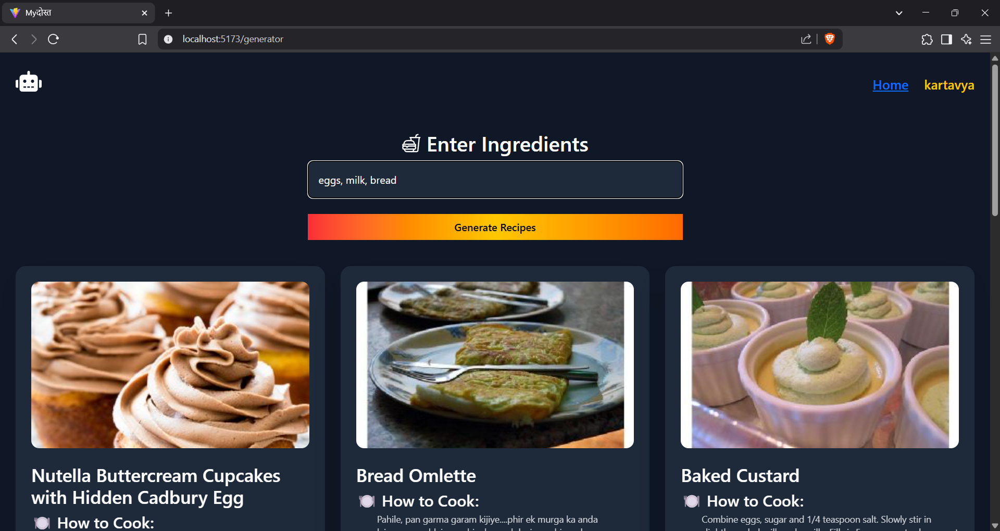
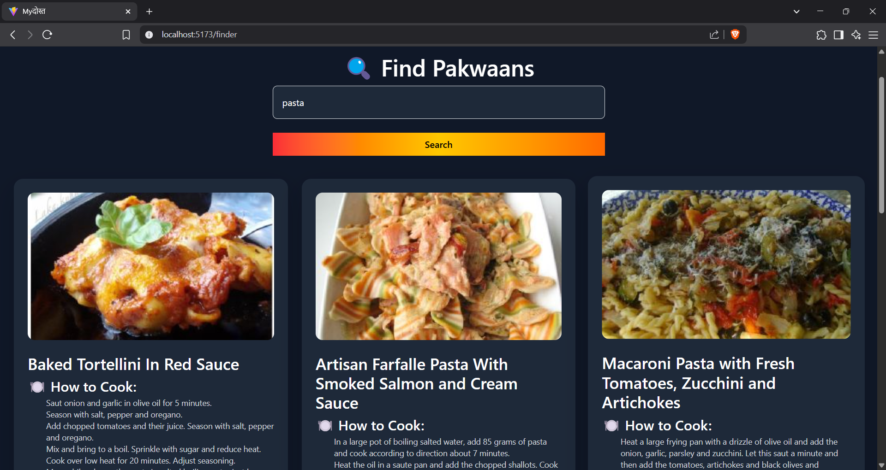
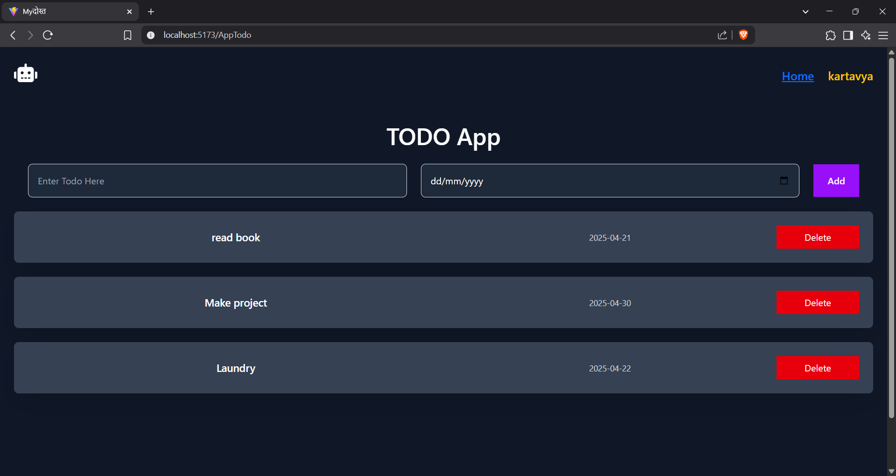
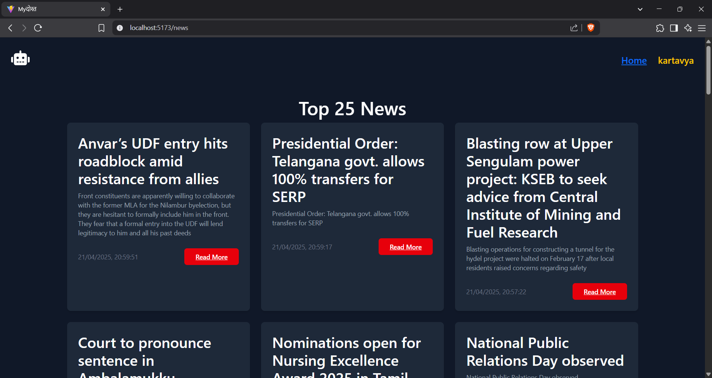

# Myदोस्त - Your Daily Companion 

## Description
Myदोस्त (meaning "my friend" in Hindi) is a comprehensive web application designed to assist users with their daily needs. It serves as a one-stop solution for accessing news, finding recipes, planning meals, and managing daily tasks - essential activities in modern daily life.

## Features

### News Section
- Real-time news updates from reliable sources
- Clean and intuitive news interface
- Category-based news filtering
- Responsive news cards with images and descriptions

### Recipe Finder
- Search recipes by name or cuisine
- Get detailed cooking instructions
- View nutritional information
- Recipe cards with high-quality images
- Calorie, protein, and fat content information

### Recipe Generator
- Generate recipes based on available ingredients
- Perfect for utilizing leftover ingredients
- Step-by-step cooking instructions
- Detailed nutritional breakdown

### Todo List
- Create and manage daily tasks
- Add tasks with due dates
- Delete completed tasks 
- Persistent storage using localStorage
- Clean and intuitive interface
- Responsive design for all devices
- Welcome message when no tasks are present

### User Authentication
- Secure signup functionality
- Client-side form validation
- Password requirements:
  - Minimum 6 characters
  - At least one uppercase letter
  - At least one number
- Email validation
- Toast notifications for user feedback
- Persistent user data using localStorage
- Automatic redirection after successful signup
- Responsive design for all screen sizes

## Tech Stack

### Frontend
- React.js with Vite
- TailwindCSS for styling
- React Icons for UI elements
- React Router for navigation
- React Toastify for notifications
- Context API for state management
- LocalStorage for data persistence

### APIs
- MediaStack API for news content
- Spoonacular API for recipe data

## Setup Instructions

1. Clone the repository
```bash
git clone https://github.com/kartavya37/myDost.git
cd myDost
```

2. Install dependencies
```bash
npm install or npm i
```

3. Create a `.env` file in the root directory and add your API keys
```properties
VITE_NEWS_API_KEY=your_mediastack_api_key
VITE_RECIPE_API_KEY=your_spoonacular_api_key
```

4. Start the development server
```bash
npm run dev
```

5. Open `http://localhost:5173` in your browser

## Screenshots

### Dashboard

*Main dashboard displaying all available features*

### Sign Up

*User authentication with form validation*

### Recipe Generator

*Generate recipes from available ingredients*

### Recipe Finder

*Search and explore detailed recipes*

### Todo App

*Task management with due dates*

### News Section

*Real-time news updates with category filtering*


Made by Kartavya.